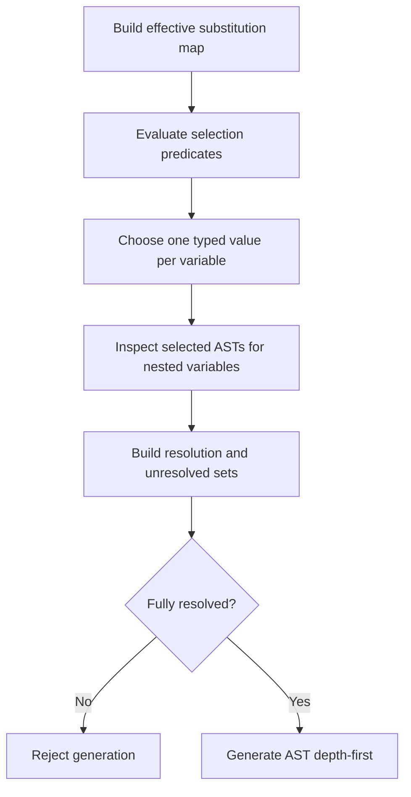
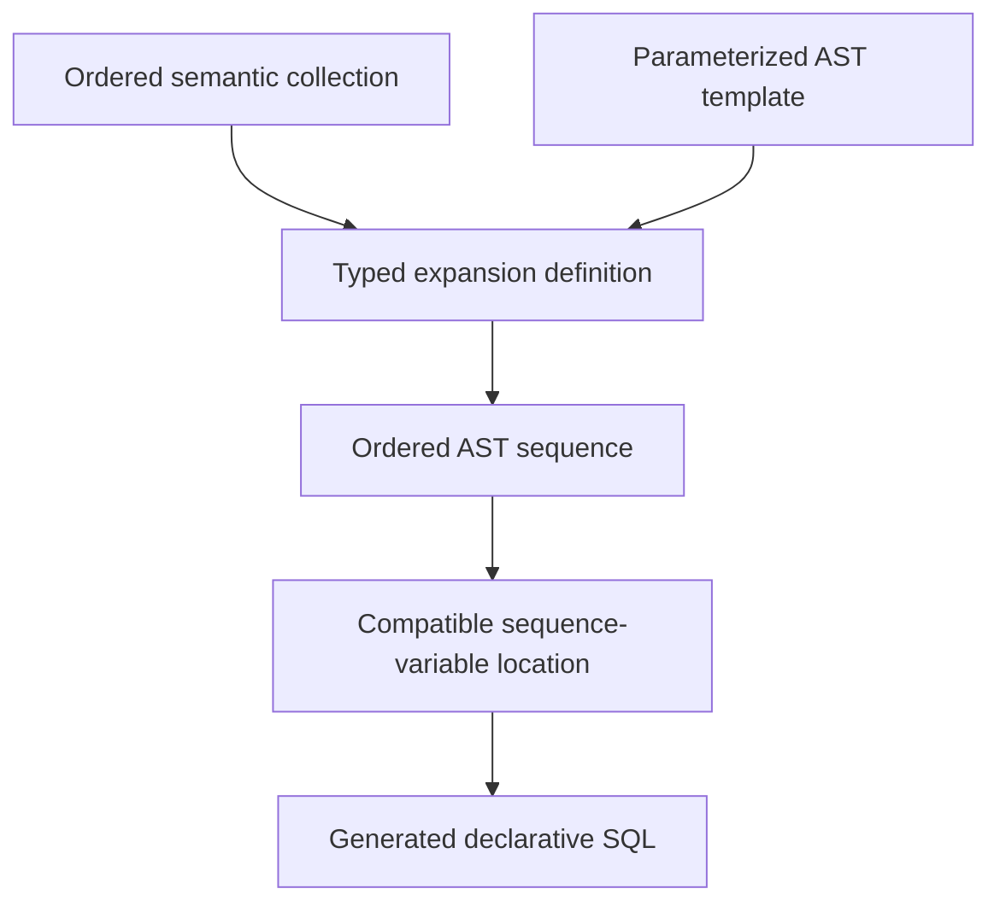

# Panto Language Enhancements: Grammar-Safe Dynamic AST Expansion

## Purpose

This document proposes language features that would expand the power and usability of Panto's variable-substitution system without converting it into a procedural text-template engine.

Panto already guarantees grammatical and syntactical compatibility by substituting typed SQL AST subtrees into compatible variable locations. The principal capability it lacks relative to text-generation systems such as Jinja is convenient, data-driven repetition: generating zero, one, or many SQL structures from a collection while remaining inside the SQL grammar.

The recommended direction is to add **typed AST sequence splicing**, followed by a small number of grammar-aware structural combinators. More general features such as parameterized snippets, declarative collection expansion, and pattern-directed AST rewriting can be added later if concrete use cases justify them.

## Related documents

| Document | Role |
| --- | --- |
| [panto-variable-inheritance-using-bundles.md](./panto-variable-inheritance-using-bundles.md) | **Authoritative background** on current Panto variable typing, bundle inheritance, substitution maps, resolution sets, and depth-first AST generation. Proposed enhancements in this file must remain consistent with those guarantees unless both documents are revised together. |

## Current Panto Foundation

Panto's current substitution model has several important properties that should be preserved:

- SQL templates are parsed into ASTs.
- Every variable occurrence is typed according to its grammatical location.
- Snippets are parsed through the endpoint associated with their variable type.
- Resolution sets associate variables with compatible snippet AST subtrees.
- Bundle imports are mandatorily sequenced, producing a deterministic resolution and override order.
- Query text is generated through a depth-first traversal of the template AST.
- When generation reaches a variable node, it traverses the corresponding snippet AST subtree in that location.
- Bundle-import cycles and recursive variable-substitution cycles are prohibited.
- A query cannot execute while its unresolved set is non-empty.

The current conceptual type is:

```text
Variable<T> -> AstNode<T>
```

Where `T` is one of Panto's grammar-bound variable types:

```text
tuple
column
predicand
condition
in_list
query
join_extension
```

## Current Dynamic Behavior and Its Limits

Panto already supports a limited form of dynamic structural growth:

1. A snippet can contain additional typed variables.
2. Resolving those variables can introduce further snippet AST subtrees.
3. A `join_extension` snippet can contain another extension variable, allowing a chain of joins to be assembled recursively.

This is recursive composition, but it is not general repetition.

- The chain must be represented through known variable dependencies.
- The number of expansions is not naturally determined by the cardinality of a collection.
- Direct self-reference would be a substitution cycle rather than a terminating loop.
- Producing a list of select expressions, joins, conditions, CTEs, or query branches generally requires the list to be constructed outside the language.

The missing abstraction is therefore not recursion itself. It is a typed way to say:

> Produce one compatible AST fragment for each member of this deterministically ordered collection, then splice the resulting nodes into this grammatical location.

## Design Goals

Any extension should:

1. Preserve Panto's guarantee of grammatical and syntactical compatibility.
2. Operate on typed AST nodes rather than emitted text.
3. Preserve deterministic resolution and generation.
4. Keep SQL templates declarative and recognizable as SQL.
5. Allow zero, one, or many structures where the SQL grammar permits those cardinalities.
6. Make expansion order, origin, and diagnostics explainable.
7. Support incremental adoption alongside existing scalar substitutions.
8. Avoid requiring a general-purpose programming language inside SQL templates.

## Explicit Non-Goals

The proposal does not seek to:

- Reproduce the full Jinja programming model.
- Add arbitrary string concatenation to SQL templates.
- Embed unrestricted loops, mutable variables, or procedural control flow in SQL.
- Permit generated punctuation or keywords to bypass the SQL grammar.
- Replace catalog, data-type, security, or semantic validation.
- Make all AST locations dynamically repeatable without explicit grammar support.

## Relevant Precedents

### JetBrains MPS

JetBrains MPS is the closest architectural precedent. It performs model-to-model transformation, keeping generated structures as nodes until a separate text-generation stage. Its generator templates include loop, conditional, selection, node-copying, collection-copying, and collection-mapping constructs. It also supports tracing generated nodes back to their origins.

The relevant lesson for Panto is that repetition and selection can occur at the model or AST level without giving the text generator procedural control. See the [JetBrains MPS Generator Cookbook](https://www.jetbrains.com/help/mps/generator-cookbook.html).

### Rust declarative macros

Rust's `macro_rules!` operates primarily on token trees rather than a fully typed application AST, but it offers a useful repetition model:

- Syntax fragments have declared kinds.
- Repetitions specify zero-or-more, one-or-more, or optional cardinality.
- Repetition can have an explicit separator.
- Nested repetition is supported.
- Multiple repeated values must have compatible cardinalities.

The transferable idea is that repetition applies to a typed or classified sequence of syntax fragments rather than arbitrary text. See the [Rust Reference: Macros by Example](https://doc.rust-lang.org/reference/macros-by-example.html#repetitions).

### Racket syntax patterns

Racket supports syntax classes, pattern variables, ellipsis-based repetition, optional syntax, and splicing syntax classes. It demonstrates that syntactically constrained macro expansion can support repetition and optionality without reducing every operation to raw text replacement. See [Racket: Parsing and Specifying Syntax](https://docs.racket-lang.org/syntax/stxparse.html).

### Rascal concrete syntax patterns

Rascal parses both object-language code and concrete syntax patterns using the same grammar. Pattern variables can appear only where a complete grammar nonterminal is permitted, and their types correspond to syntax nonterminals. This closely resembles Panto's typed variable locations. See [Rascal Concrete Patterns](https://www.rascal-mpl.org/docs/Rascal/Patterns/Concrete/).

### Stratego and Spoofax

Stratego separates structural rewrite rules from the strategies that traverse trees. It supports conditional and parameterized rules, list decomposition and reconstruction, and transformations such as mapping a strategy over every element in an AST list.

This is a possible long-term direction for Panto, but it represents a substantially larger language-design commitment than typed sequence substitution. See [Spoofax Stratego Rewrite Rules](https://spoofax.dev/references/stratego/rewrite-rules/).

## Recommended Enhancement 1: Cardinality-Aware Typed Variables

Extend the conceptual variable type from a single AST node to a typed AST value with explicit cardinality:

```text
Variable<T, Cardinality> -> AstValue<T, Cardinality>

Cardinality:
    exactly_one
    zero_or_one
    zero_or_more
    one_or_more
```

The existing behavior becomes `Variable<T, exactly_one>`.

A sequence-valued resolution entry would contain an ordered list of compatible AST subtrees:

```text
Variable<select_item, one_or_more>
    -> [SelectItemAst, SelectItemAst, SelectItemAst]
```

When the depth-first generator encounters this variable, it splices the resolved child nodes into the containing AST list. The grammar owns the delimiters and separators. Individual snippets do not emit commas, conjunctions, clause keywords, or other connecting text.

### Why cardinality belongs in the type

Cardinality determines whether the result is grammatically usable:

- A select list normally requires at least one element.
- A join-extension list can validly contain no joins.
- An optional clause can accept zero or one subtree.
- A scalar expression location must accept exactly one predicand.

Treating cardinality as part of the variable contract allows invalid empty or multi-node results to be rejected before query generation.

## Recommended Enhancement 2: Grammar-Owned Sequence Splicing

Panto should support sequence variables only at AST locations whose grammar production explicitly permits multiple children.

Candidate sequence locations include:

| Candidate sequence | Element type | Typical output |
| --- | --- | --- |
| Select-item sequence | `predicand` or a more specific select-item type | `expr1 AS a, expr2 AS b` |
| Tuple sequence | `tuple` | Multiple `FROM` sources |
| Join sequence | `join_extension` | An ordered chain of joins |
| Condition sequence | `condition` | A collection awaiting Boolean folding |
| Query sequence | `query` | Set-operation branches |
| CTE sequence | CTE definition AST | Multiple `WITH` items |
| Grouping sequence | Grouping element AST | Multiple `GROUP BY` elements |
| Ordering sequence | Ordering element AST | Multiple `ORDER BY` items |
| Assignment sequence | Assignment AST | Multiple `UPDATE SET` assignments |
| Value-row sequence | Row-value AST | Multiple rows in a `VALUES` constructor |

Internally, a generic `sequence<T>` abstraction is preferable to separately implementing every list type. Each grammar location declares:

- Its accepted element type
- Permitted cardinalities
- Child ordering
- Separator or connective construction
- Empty-sequence behavior

### Non-normative conceptual example

```sql
SELECT <Field Projections>
FROM <Source>;
```

Conceptual resolution value:

```yaml
variable: Field Projections
type: sequence<select_item>
cardinality: one_or_more
values:
  - student_id AS student_id
  - birthdate AS birthdate
  - email_address AS email_address
```

The YAML is illustrative only. The operative value would be an ordered collection of parsed select-item ASTs. The select-list AST production would place commas between generated children.

### Proposed cardinality syntax

A cardinality annotation on the variable reference provides an explicit signal that the occurrence represents a sequence splice rather than a scalar substitution:

| Syntax | Meaning |
| --- | --- |
| `<name>` | Exactly one AST value; existing behavior |
| `<name[?]>` | Zero or one value |
| `<name[*]>` | Zero or more values |
| `<name[+]>` | One or more values |
| `<name[n]>` | Exactly `n` values |
| `<name[m..n]>` | From `m` through `n` values |
| `<name[m..*]>` | At least `m` values with no declared upper bound |

For example:

```sql
SELECT <Projection[1..*]>
FROM tab1;
```

The cardinality suffix should be parsed as metadata on the variable occurrence. It should not become part of the variable's canonical name:

```text
VariableOccurrence:
    name: Projection
    baseType: select_item
    nodeKind: sequence_splice
    cardinality:
        minimum: 1
        maximum: unbounded
    astRole: select_item_list.element
```

The semantic distinction is:

```text
<Projection>       -> One<SelectItem>
<Projection[*]>    -> Sequence<SelectItem>
```

The second form is not a scalar value with an indeterminate cardinality. It represents zero or more children to be contributed to a repeatable role of the parent AST node.

### Broad parsing with semantic location validation

The grammar does not need a separate cardinality-bearing variable production for every AST location. A simpler implementation is:

1. Extend the common variable syntax so the parser can recognize an optional cardinality suffix wherever a Panto variable is otherwise legal.
2. Preserve the normal context-derived base type, such as `predicand`, `tuple`, or `condition`.
3. Add the cardinality contract to the variable occurrence in the AST.
4. Let semantic validation inspect the occurrence's parent AST role and determine whether that cardinality is legal there.
5. Reject an incompatible cardinality before resolution or generation.

Conceptually:

```text
parseVariable():
    recognize name and optional cardinality
    construct VariableOccurrence

walkAndType(variable, context):
    variable.baseType = deriveTypeFromAstContext(context)
    variable.astRole = deriveParentRole(context)

validateCardinality(variable):
    capability = cardinalityCapabilities[variable.astRole]
    require capability accepts variable.cardinality
```

This avoids complicating the SQL grammar solely to prevent misuse. The parser can recognize the language feature consistently, while the semantic validation layer provides a precise error based on the actual AST role:

```text
Variable <Threshold[*]> is a sequence<predicand>, but the right operand of
a comparison requires exactly one predicand.
```

The grammar still determines the available AST roles and their structure. Semantic validation determines whether a scalar variable occurrence at a given role may be promoted to an optional or repeated splice.

### Variable cardinality versus parent cardinality

The variable's declared range and the parent production's cardinality are separate constraints. The resolved result must satisfy both.

For example:

```sql
SELECT <Projection[0..3]>
FROM tab1;
```

The variable permits zero through three values, but the select list requires at least one item. The effective valid result is therefore one through three items. Resolving `Projection` to zero elements must fail validation.

By contrast:

```sql
SELECT student_id, <OptionalAttributes[0..3]>
FROM tab1;
```

can validly resolve `OptionalAttributes` to zero elements because `student_id` already satisfies the parent select list's minimum cardinality.

### Why select-list sequences should use `select_item`

At a select-list position, a repeated item is usually more than a predicand. It can also contain an alias or other select-item structure:

```sql
student_id AS username,
birthdate AS date_of_birth,
email_address
```

A predicand represents the value-producing expression, while a select item includes the expression and its associated alias. A sequence variable replacing an entire select list should therefore normally resolve as:

```text
Sequence<SelectItem>
```

rather than:

```text
Sequence<Predicand>
```

This suggests adding a `select_item` or `select_item_list` parser endpoint and internal AST type, even if Panto continues to infer the public variable type from context.

The system should initially reject ambiguous constructs such as:

```sql
SELECT <Projection[*]> AS one_alias
FROM tab1;
```

It is unclear whether the alias applies to every element, the final element, or the sequence as a whole. Each generated select-item AST should carry its own alias.

Similarly, this implicit lifting should initially be avoided:

```sql
SELECT studentTable.<Columns[*]>
FROM tab1 studentTable;
```

The clearer form is:

```sql
SELECT <Columns[*]>
FROM tab1 studentTable;
```

where each resolved select-item AST contains its complete qualification.

### Parent ownership of punctuation and connectors

Separators must belong to the parent AST production rather than to the variable or snippet text.

Consider:

```sql
SELECT student_id, <OptionalAttributes[*]>, created_at
FROM tab1;
```

If `OptionalAttributes` resolves to no items, Panto should generate:

```sql
SELECT student_id, created_at
FROM tab1;
```

The generator should not remove commas from text. Expansion should first flatten the AST children:

```text
Before expansion:
    SelectItem(student_id)
    Splice(OptionalAttributes)
    SelectItem(created_at)

After zero-item expansion:
    SelectItem(student_id)
    SelectItem(created_at)
```

The select-list generator then emits commas between the final children in grammatical order. The same principle applies to conjunctions, set operators, join chains, and other connecting syntax, although those structures may require an explicit fold rather than ordinary list splicing.

### Storage and normalization of list values

A sequence variable should still have one substitution-map entry. Repeating the same map key for every element would conflict with the existing effective-map and override model.

Conceptually:

```text
SubstitutionMap["Projection"] =
    AstSequence<SelectItem>([
        SelectItemAst(...),
        SelectItemAst(...),
        SelectItemAst(...)
    ])
```

Panto could allow the stored representation to be either:

- An explicitly ordered collection of independently parsed snippets
- A single list-form snippet parsed through a list endpoint and normalized into an ordered AST sequence

For DBT migration, accepting a complete list-form snippet may be particularly convenient:

```sql
student_id AS username,
birthdate AS date_of_birth,
email_address
```

The parser would normalize this into three `SelectItemAst` elements before placing it in the substitution or resolution value.

### Interaction with conditional alternatives

Cardinality integrates naturally with typed conditional selection:

```sql
SELECT <Projection[1..*]>
FROM <Source>;
```

Conceptual resolution value:

```text
Choice<Sequence<SelectItem>>:
    when output_mode = detail:
        [student_id, first_name, last_name, birthdate]

    when output_mode = identity:
        [student_id, email_address]

    otherwise:
        [student_id]
```

Every branch must produce a value compatible with the same variable signature:

```text
element type:  select_item
cardinality:   1..*
parent role:   select_item_list.element
```

Only the selected branch contributes nodes and nested variable dependencies to the resolution set.

### Repeated occurrences and signature consistency

If a named variable appears more than once in a template or dependency graph, its occurrences should have compatible signatures. The system should reject using one substitution-map key as both a scalar and a sequence:

```sql
SELECT <Value>
FROM tab1
WHERE id IN (<Value[*]>);
```

The clearer design uses separate variables:

```sql
SELECT <SelectedValue>
FROM tab1
WHERE id IN (<FilterValues[*]>);
```

Compatibility should include at least:

- Canonical variable name
- Base grammatical type
- AST role or compatible role family
- Scalar versus sequence node kind
- Cardinality contract

### Extended variable names

Panto already supports multipart variable names such as:

```text
<[Enrollment Services].[Client Entering Class]>
```

A cardinality suffix could produce a visually dense form:

```text
<[Enrollment Services].[Client Entering Class][*]>
```

The lexer should recognize cardinality only as a final bracketed component immediately before `>`, and only when the contents match a cardinality form such as `?`, `*`, `+`, an integer, or a numeric range. Bracketed identifier parts remain part of the variable name.

Alternative delimiters such as `{*}` could be considered if the existing extended-name lexer makes the square-bracket suffix ambiguous. The final syntax should be tested against all current simple and multipart variable forms before adoption.

### Candidate locations for cardinality variables

Cardinality support should be introduced by AST role rather than enabled globally for every occurrence of a base type. The following matrix is a starting point for semantic-validation policy.

#### Directly spliceable list roles

These locations naturally contain ordered sibling nodes and can generally support sequence splicing once the parent generator owns separators:

| SQL location | Sequence element | Potential value | Notes |
| --- | --- | --- | --- |
| `SELECT` item list | `select_item` | High | Primary DBT migration use case; aliases belong to individual elements |
| `GROUP BY` element list | grouping element or `predicand` | High | Straightforward ordered comma-separated splice |
| `ORDER BY` item list | ordering item | High | Each item must retain direction and null-ordering attributes |
| Window `PARTITION BY` list | `predicand` | Medium | Natural list role inside the window specification |
| Window `ORDER BY` list | ordering item | Medium | Same considerations as top-level `ORDER BY` |
| Function argument list | function argument or `predicand` | Medium | Legal only at the argument-list role, not at a singular function argument with special grammar |
| CTE list | CTE definition | High | Names, ordering, forward-reference rules, and duplicates require validation |
| `FROM` source list | `tuple` | Medium | Grammar permits it, but implicit cross-product behavior deserves warnings or policy controls |
| `UPDATE SET` list | assignment | Medium | Each sequence element should be a complete assignment, not merely a predicand |
| `VALUES` row list | row-value constructor | Medium | Each element is a complete row; row-shape consistency must be checked |
| `INSERT` column list | column or insert-column node | Medium | Usually coordinated with values or query output and therefore requires cross-list validation |
| PIVOT aggregate list | pivot aggregate item | Medium | Dialect-specific endpoint and derived-column naming rules apply |
| PIVOT `IN` item list | pivot value/alias item | Medium | Each entry may contain both a value and output prefix |

#### Structurally repeatable roles requiring a fold

These locations can benefit from multiple values, but raw sibling splicing is not enough because SQL requires an operator or structural relationship between elements:

| SQL location | Input element | Required constructor | Notes |
| --- | --- | --- | --- |
| `WHERE`, `HAVING`, or `QUALIFY` condition | `condition` | `conjunction` or `disjunction` | The choice of `AND` versus `OR` must be explicit |
| `JOIN ... ON` condition | `condition` | `conjunction` or `disjunction` | A raw condition sequence is not a valid single `ON` condition |
| Query set-operation chain | `query` | `UNION`, `UNION ALL`, `INTERSECT`, or `EXCEPT` fold | Operator and precedence must be explicit |
| `COALESCE` or similar expression | `predicand` | Function-constructor fold | Parentheses and argument ordering belong to the constructor |
| Boolean `CASE WHEN` alternatives | when/then pair | CASE-branch constructor | Conditions and results must remain paired |
| Join chain | `join_extension` | ordered join-chain constructor | Existing recursive `join_extension` may already cover many needs |

The `join_extension` location is a plausible sequence-splice candidate, although the existing recursive extension variable may be sufficient for many cases. A first implementation should compare the operational clarity of an explicit `Sequence<JoinExtension>` against the current recursive chaining technique before introducing both models.

#### Coordinated sequence roles

Some valid list expansions cannot be validated independently because their elements correspond positionally or structurally to another list:

| Scenario | Required coordination |
| --- | --- |
| `INSERT` column list with `VALUES` row | Column count must match every row-value count |
| Multi-column assignment | Target-column and source-expression arity must agree |
| Row-value comparison | Left and right row widths must agree |
| Parallel aliases and expressions | Alias association should be stored in each complete item rather than zipped implicitly |
| PIVOT values and generated output names | Value, alias, and aggregate-derived name rules must remain aligned |
| Conditional projection with downstream contract | Selected output columns may need to satisfy a declared result signature |

Where possible, Panto should represent the coordinated unit as one AST element, such as a complete assignment or select item, instead of maintaining parallel sequences that must be zipped.

#### Singular roles that should reject repeated cardinality

The common variable grammar may parse cardinality syntax in these locations, but semantic validation should normally reject any maximum cardinality greater than one:

| SQL location | Typical base type | Reason repetition is invalid or misleading |
| --- | --- | --- |
| Arithmetic operand | `predicand` | An operator expects one left or right expression |
| Comparison operand | `predicand` | A scalar comparison side requires one expression unless the grammar explicitly uses a row constructor |
| Assignment right-hand side | `predicand` | One target assignment requires one value expression |
| Scalar subquery position | `query` | The surrounding expression expects one query subtree |
| `CASE WHEN` condition | `condition` | A branch requires one condition; multiple conditions require an explicit Boolean fold |
| `CASE THEN` or `ELSE` result | `predicand` | Each branch requires one result expression |
| DML target table | `tuple` | A statement normally has one target relation |
| CTE body | `query` | One CTE definition has one query body |
| Derived-table body | `query` | One derived table contains one query subtree |
| Alias position | identifier or alias | One syntactic object receives one alias |
| `LIMIT`, `OFFSET`, or sampling quantity | `predicand` or literal | The clause expects one quantity expression |
| Window frame boundary | frame-bound expression | Each boundary is singular |
| Unary operator operand | `predicand` or `condition` | The operator applies to one subtree |
| A fixed-arity function argument role | `predicand` | Repetition would change the function signature unless the role is explicitly the variable-length argument list |

The core rule is:

> Cardinality greater than one is legal only when the variable occurrence maps to a parent AST role that can consume multiple children directly or through an explicitly declared fold.

### Semantic validation registry

The semantic validator can implement this rule through a capability registry keyed by AST role:

```text
CardinalityCapability:
    astRole
    elementType
    allowedRange
    expansionMode:
        scalar
        optional
        direct_splice
        fold_required
        coordinated
        prohibited
    parentMinimum
    parentMaximum
    permittedFolds
    diagnostics
```

Illustrative entries:

```text
select_item_list.element:
    elementType: select_item
    allowedRange: 0..*
    expansionMode: direct_splice
    parentMinimum: 1

comparison.right_operand:
    elementType: predicand
    allowedRange: 1..1
    expansionMode: scalar

where_clause.condition:
    elementType: condition
    allowedRange: 1..1 without fold
    expansionMode: fold_required for cardinality > 1
    permittedFolds: [conjunction, disjunction]

dml.target_table:
    elementType: tuple
    allowedRange: 1..1
    expansionMode: prohibited for sequence splice
```

This centralizes policy without encoding every restriction into grammar alternatives. It also gives the Query Tool enough information to offer context-specific editing assistance and errors.

### Consolidated recommendation for cardinality syntax

Adopt the following interpretation:

```text
<name>           = scalar AST substitution
<name[range]>    = AST sequence-splice request with declared cardinality
```

With these rules:

1. The common variable grammar recognizes the optional suffix.
2. The suffix is metadata and is not part of the canonical variable name.
3. AST context still determines the base variable type.
4. Semantic validation determines whether the occurrence's AST role supports that cardinality.
5. The parent AST owns separators and connecting syntax.
6. The resolution value is an ordered collection of typed AST nodes.
7. Variable, parent, and coordinated-structure cardinalities must all validate.
8. Repeated elements carry their complete item-level structure, including aliases where applicable.
9. Multiple occurrences of one variable must have compatible signatures.
10. Conditional alternatives must all satisfy the same element-type and cardinality contract.

This design makes repetition explicit and readable in SQL templates without burdening the grammar with every legality rule or introducing procedural text generation.

## Recommended Enhancement 3: Typed Structural Folds

Some repeated structures are not simple separator-delimited lists. Conditions and set-operation branches require structural operators. Panto should provide a small, controlled set of typed folds rather than a generic loop language.

| Fold | Input | Result |
| --- | --- | --- |
| `comma_sequence` | Ordered grammar-list elements | AST sibling list |
| `conjunction` | Ordered `condition` sequence | `c1 AND c2 AND c3` |
| `disjunction` | Ordered `condition` sequence | `c1 OR c2 OR c3` |
| `union_all` | Ordered `query` sequence | `q1 UNION ALL q2 ...` |
| `union_distinct` | Ordered `query` sequence | `q1 UNION q2 ...` |
| `join_chain` | Ordered `join_extension` sequence | Sequential join subtree |
| `coalesce_chain` | Ordered `predicand` sequence | `COALESCE(e1, e2, ...)` |

Every fold must define zero-, one-, and many-element behavior.

Examples:

- Empty `join_chain`: validly produces no join.
- One-element `join_chain`: produces the join without additional structure.
- Empty `conjunction`: might produce `TRUE`, omit an explicitly optional containing clause, or be prohibited. The language specification must choose one behavior for each context.
- Empty select sequence: invalid.
- Empty `union_all`: invalid.

These operations remain declarative AST constructors. They do not expose iteration variables, mutable state, or text emission.

## Recommended Enhancement 4: Optional and Alternative AST Values

Repetition naturally exposes the need for structural optionality and choice:

```text
optional<T>  = zero_or_one<T>
choice<T>    = exactly_one alternative<T>
sequence<T>  = ordered zero_or_more<T> or one_or_more<T>
```

Potential uses include:

- Optional joins
- Optional select items
- Optional filters or clauses
- Dialect-specific query alternatives
- Capability-specific source implementations
- One of several standard formulas

Selection criteria should be declarative properties available during resolution, such as SQL dialect, bundle configuration, target capability, or metadata classification. Arbitrary procedural conditions should not be embedded in SQL template text.

Clause-level optionality requires care. Omitting the condition subtree from `WHERE <condition>` cannot leave the `WHERE` keyword behind. An optional whole-clause variable or a grammar-aware optional clause node may therefore be necessary.

### Resolution-time selection versus SQL conditions

DBT/Jinja conditions normally execute before SQL reaches the database. They select which SQL structure will be produced for a run. This differs from a SQL condition evaluated by the database for each row.

Panto should distinguish:

- **Selection predicates**, evaluated by Panto against resolution context before SQL generation. These may select the shape of the query.
- **SQL conditions**, represented by Panto's existing `condition` AST type and evaluated later by the database.

The term `selection predicate` avoids confusing conditional resolution with the existing SQL `condition` variable type.

### Typed choice values

Conditional logic should surround typed AST alternatives rather than appear inside SQL snippet text:

```text
ResolvedValue<T> =
      One<T>
    | Optional<T>
    | Sequence<T>
    | Choice<ResolvedValue<T>>
```

A choice definition contains selection predicates and compatible resolved values:

```text
Choice<T>:
    alternatives:
        - selectionPredicate
          value: ResolvedValue<T>
        - selectionPredicate
          value: ResolvedValue<T>
        - otherwise
          value: ResolvedValue<T>
```

Every alternative must independently satisfy the variable's base type, AST role, and cardinality. Panto therefore preserves its central guarantee regardless of which branch is selected: the selected result is already a grammatically compatible AST value.

### Selection timing

Choice evaluation should occur after effective bundle composition identifies the winning definition for a variable but before recursive dependency resolution finishes:



Only the selected branch contributes nested variable dependencies. Variables referenced exclusively by unselected alternatives should not enter the unresolved set for that execution.

### Resolution context

Initial selection predicates should be restricted to an immutable resolution context established before substitution begins. Candidate properties include:

- Execution or output mode
- Tenant or partner identity
- Service
- SQL dialect and target database
- Deployment environment
- Bundle parameter
- Feature or capability flag
- Effective date
- Incremental versus full-refresh mode

Initially allowing predicates to depend on arbitrary substitution variables would create another potentially cyclic dependency graph. That capability should be deferred until concrete needs justify its resolution and cycle semantics.

### Choice matching semantics

Two matching modes are useful:

| Mode | Behavior | Recommended use |
| --- | --- | --- |
| `first_match` | Evaluate alternatives in mandatory order and select the first true predicate | Direct migration of Jinja `if`/`elif`/`else` chains |
| `exactly_one` | Evaluate all alternatives and require exactly one match | Newly designed Panto logic where overlapping predicates indicate an error |

Recommended rules:

- Use `exactly_one` as the default for new designs.
- Permit explicit `first_match` for migration fidelity.
- Require an `otherwise` branch unless the value is explicitly optional.
- In `first_match` mode, consider warning when later predicates are also true but shadowed.

### Variable-level choice versus bundle-level variants

A variable-level choice is appropriate when one grammatical value changes independently:

```text
<Projection> -> Choice<Sequence<SelectItem>>
```

Jinja conditions often change several distant query regions together, such as the projection, joins, filters, and grouping. Independent choices on each variable could select an invalid combination. Panto should use a bundle-level variant or conditional bundle overlay for coordinated changes:

| Variable | Detail variant | Aggregate variant |
| --- | --- | --- |
| `<Projection>` | Detail select-item sequence | Aggregate select-item sequence |
| `<Joins>` | Detail join sequence | Aggregate join sequence |
| `<Filter>` | Detail condition | Aggregate condition |
| `<Grouping>` | Empty | Aggregate grouping sequence |

The selected variant contributes a coherent group of variable-snippet pairs and then participates in the existing deterministic bundle precedence model.

### Result-shape compatibility

Selecting among complete projection lists can change the query's output schema. Panto should make that difference visible rather than treating it as an incidental consequence of generated text.

Possible policies include:

- Permit different schemas for a query explicitly declared to have variant output.
- Require identical aliases and compatible types for a stable-contract query.
- Warn when branches produce different names, arities, or inferred types.
- Validate downstream consumers against every reachable result variant.
- Record the selected result signature for each execution.

Because Panto retains every branch as parsed structure, it can analyze alternative result shapes before execution in a way that conventional Jinja text generation generally cannot.

### DBT/Jinja migration mapping

| DBT/Jinja construct | Proposed Panto representation |
| --- | --- |
| `{{ ref(...) }}` | Typed `tuple` variable or metadata-backed table reference |
| `{{ source(...) }}` | Typed `tuple` variable |
| `var(...)` | Immutable resolution-context property |
| `target.name` | Target or environment context property |
| `is_incremental()` | Selection predicate over execution mode |
| `if` around one expression | `Choice<One<predicand>>` |
| `if` around one predicate | `Choice<One<condition>>` |
| `if` around a select list | `Choice<Sequence<select_item>>` |
| `if` changing several clauses | Conditional bundle variant or overlay |
| `for` over columns | Declarative expansion to `Sequence<select_item>` |
| `for` producing conditions | Expansion followed by `conjunction` or `disjunction` |
| Reusable macro returning one SQL fragment | Parameterized typed snippet |
| Macro returning several coordinated fragments | Parameterized bundle or structured expansion |
| Jinja temporary scalar | Resolution-context property or derived declarative value |

### Initial conditional-migration slice

A useful first vertical slice for DBT migration would:

1. Support a select-item-list variable such as `<Projection[1..*]>`.
2. Add `Choice<ResolvedValue<T>>` to the resolution model.
3. Evaluate selection predicates against an immutable resolution context.
4. Support explicit `first_match` with `otherwise` for direct Jinja migration.
5. Parse and validate every branch independently.
6. Add dependencies only from the selected branch to the resolution set.
7. Generate the selected sequence through ordinary depth-first AST generation.
8. Reparse the completed SQL as a final invariant check.
9. Report the selected branch, relevant context values, and resulting output signature.

The governing convention is:

> Conditional logic selects among already typed AST values. It does not participate directly in writing SQL text.

## Recommended Enhancement 5: Parameterized Typed Snippets

Nested variables already allow one snippet to depend on other snippets, but the dependency contract is implicit. Panto could make reusable snippet constructors explicit by giving them typed parameters and a typed result.

Conceptual definition:

```text
Snippet: QualifiedProjection
Returns: select_item
Parameters:
    expression: predicand
    alias: identifier
Body:
    <expression> AS <alias>
```

Parameterized snippets would provide:

- Explicit input and output types
- Earlier validation
- Clearer dependency graphs
- Reuse with different argument bindings
- Better documentation and diagnostics
- A natural template for collection expansion

They should remain AST constructors. Parameter binding substitutes typed AST arguments into typed AST parameter locations.

## Recommended Enhancement 6: Declarative Collection Expansion

Once Panto supports typed sequences and parameterized snippets, it can add a first-class expansion definition that maps an ordered collection to an AST template.

Conceptual model:

```text
Expansion<OutputType>:
    source: OrderedCollection<InputType>
    itemBinding: InputType
    template: ParameterizedSnippet<InputType, OutputType>
    cardinality: Cardinality
    order: RequiredTotalOrder
```

The processing model is:



The expansion definition should live in bundle metadata or another structured Panto artifact, not as procedural control syntax mixed into SQL text. The SQL template continues to contain only a typed, grammar-bound variable.

### Potential expansion sources

The language must explicitly define which collections can participate. Candidates include:

- An ordered literal collection stored in a bundle
- A versioned metadata projection
- A collection of concepts or representations from Panto metadata
- A pre-resolved, typed collection supplied to the bound query
- The result of another declarative Panto collection expression

Allowing arbitrary database queries to drive generation would introduce reproducibility, security, performance, and lifecycle concerns. If database-backed expansion is ever supported, its snapshot, ordering, authorization, and version semantics must be explicit.

## Possible Long-Term Enhancement: Pattern-Directed AST Rewriting

A later Panto version could support typed structural rewrite rules:

```text
match:
    SELECT <projection> FROM <source>

rewrite:
    SELECT <projection> FROM <source> WHERE <tenant_condition>
```

Potential uses include:

- Adding standard tenant restrictions
- Normalizing dialect-specific expressions
- Applying security policies
- Replacing semantic concepts with physical implementations
- Rewriting every matching subtree in a query

This direction should be deferred until explicit variable and expansion mechanisms prove insufficient. A general rewrite language creates substantial complexity:

- Rule ordering and precedence
- Overlapping matches
- Local versus global application
- Fixed-point semantics
- Rewrite cycles
- Idempotence
- Scope and name capture
- Debugging and origin explanation

Panto's explicit variable locations provide much stronger local reasoning and should remain the preferred mechanism.

## Proposed Type Model

A possible type algebra is:

```text
AstValue<T> =
      One<AstNode<T>>
    | Optional<AstNode<T>>
    | Sequence<AstNode<T>>
    | Choice<AstValue<T>>
    | Expansion<SourceType, AstNode<T>>

ResolutionEntry<T>:
    variableName
    variableType: T
    cardinality
    astValue: AstValue<T>
    provenance
```

Generation remains depth-first:

```text
generate(node):
    if node is ScalarVariable<T>:
        generate(resolveOne<T>(node))

    else if node is SequenceVariable<T>:
        values = resolveSequence<T>(node)
        validateCardinality(node, values)
        generateChildrenUsingParentGrammar(node.parent, values)

    else if node is OptionalVariable<T>:
        value = resolveOptional<T>(node)
        if value exists:
            generate(value)

    else:
        for child in node.children in grammatical order:
            generate(child)
```

Choice evaluation and expansion can occur before final generation, producing ordinary typed AST values. That keeps the text generator simple and preserves the current separation between resolution and generation.

## Determinism and Reproducibility Requirements

Dynamic expansion must preserve Panto's deterministic behavior.

### Required ordering

Every collection must expose a deterministic total order. An unordered set or a database result without an explicit ordering contract is not a valid expansion source.

The order should be part of the resolved artifact, not inferred from incidental storage or retrieval order.

### Stable identity

Every expanded item should have a stable identity so diagnostics and version comparisons can distinguish:

- An item added or removed
- An item reordered
- A template changed
- A source property changed
- A different bundle override selected

### Version capture

A resolved bound query should record the exact versions of:

- SQL template
- Root and imported bundles
- Snippets or parameterized snippet definitions
- Expansion definitions
- Expansion-source collection or snapshot

Without this information, dynamically generated SQL may not be reproducible later.

## Validation Requirements

### Grammar and cardinality

- Parse the cardinality suffix through the common variable syntax rather than duplicating it throughout the SQL grammar.
- Use semantic validation against a registry of AST-role capabilities to accept or reject optional and repeated cardinalities.
- Validate every generated node against the sequence element type.
- Validate zero, one, or many results against the target cardinality.
- Validate the final flattened child count against the parent grammar production's cardinality.
- Let the containing grammar production construct separators and operators.
- Reject an expansion that would leave a required grammar node empty.

### Scope and names

- Validate generated aliases against the surrounding query scope.
- Detect duplicate select aliases where prohibited or operationally dangerous.
- Detect duplicate CTE names.
- Detect ambiguous table and column references introduced by expansion.
- Preserve qualification information associated with the variable location.

### Cycles and termination

- Extend dependency-cycle detection to parameterized snippets and expansion definitions.
- Prohibit an expansion source from depending recursively on its own output unless a separately specified, provably terminating recursion model is introduced.
- Consider configurable limits on expansion depth and generated-node count as operational safeguards.

### Semantic boundaries

Typed AST substitution guarantees grammatical and syntactical compatibility. It does not by itself guarantee:

- That referenced objects exist
- That source and target SQL data types are compatible
- That aliases or columns resolve as intended
- That a query is secure or appropriately authorized
- That the generated query preserves intended business meaning

Those properties require catalog, type, security, and semantic validation layers.

## Provenance and Explainability

Dynamic expansion will be difficult to operate unless every generated node retains origin information.

Recommended provenance for each generated subtree:

- Template and variable occurrence
- Variable type and cardinality
- Resolution-set entry
- Root and contributing bundle versions
- Snippet or parameterized snippet version
- Expansion definition
- Source collection and source item identity
- Position in the mandatory expansion order
- Fold or structural combinator applied

The Query Tool should eventually be able to answer:

- Why was this SQL fragment generated?
- Which bundle or expansion supplied it?
- Which collection item caused this repetition?
- Why did this item appear in this position?
- Which value overrode another value?
- Why were zero or multiple nodes legal here?

This is the dynamic-expansion equivalent of the current resolution-sequence explanation.

## Recommended Delivery Sequence

### Phase 1: Typed sequences and splicing

Implement:

- `sequence<T>` resolution values
- `<name[range]>` cardinality syntax
- `zero_or_more` and `one_or_more` cardinalities
- Grammar-owned ordered splicing
- An AST-role cardinality-capability registry in semantic validation
- One or two initial locations, preferably select items and join extensions
- Deterministic-order validation
- Provenance for every generated child

This phase provides the highest value while changing the fewest concepts.

### Phase 2: Optional values and structural folds

Implement:

- `zero_or_one<T>`
- Optional whole-clause handling where justified
- `conjunction`
- `disjunction`
- `join_chain`
- `union_all`
- Explicit empty and singleton semantics

### Phase 3: Parameterized snippets

Implement:

- Typed parameter declarations
- Typed result declarations
- Parameter binding validation
- Reusable snippet instantiation
- Dependency and provenance reporting

### Phase 4: Declarative collection expansion

Implement:

- Approved ordered collection sources
- Mapping a parameterized snippet across a collection
- Stable source-item identity
- Versioned source snapshots
- Expansion previews and diagnostics

### Phase 5: Evaluate structural rewriting

Only after observing real limitations of the explicit mechanisms, evaluate:

- Typed pattern matching
- Local rewrite rules
- Controlled traversal strategies
- Rule precedence
- Rewrite termination

Do not assume that a general rewrite language will be required.

## Recommended First Increment

The smallest meaningful implementation is:

> Allow a cardinality-bearing variable such as `<name[1..*]>` to resolve to a deterministically ordered sequence of same-type snippet ASTs, validate its legality against the variable's AST role, and splice those nodes into the parent structure during depth-first generation.

Start with two concrete uses:

1. A sequence of select-list items or predicands.
2. A sequence of `join_extension` subtrees.

These cases exercise both punctuation-delimited and structurally chained repetition while remaining easy to inspect.

### Acceptance criteria

- Existing exactly-one variables behave without change.
- The common variable syntax parses supported cardinality suffixes wherever a Panto variable is otherwise legal.
- Semantic validation rejects a sequence request at an AST role that supports only a scalar value.
- A sequence variable is operationally legal only in registered direct-splice, folded, or coordinated locations.
- Every sequence element is parsed and validated using the required element endpoint.
- Expansion order is mandatory and reproducible.
- The parent AST production generates separators or join ordering.
- Mixed fixed and expanded children generate correct punctuation when a sequence resolves to zero elements.
- Empty sequences are accepted or rejected according to declared cardinality.
- The final flattened parent node satisfies its own minimum and maximum cardinality.
- Nested variables inside sequence elements resolve normally.
- Import and variable-cycle detection continue to operate.
- Generated SQL reparses successfully through the full SQL endpoint.
- Diagnostics identify the origin and ordinal position of every generated element.
- The UI can preview the expanded resolution value before execution.

## Open Design Questions

The following decisions should be made before implementation:

1. Should the textual cardinality suffix be required on every sequence occurrence, or can a stored variable definition supply a default cardinality?
2. Which AST list locations should be supported initially?
3. Should sequence elements be stored directly in bundles, derived from another Panto artifact, or both?
4. What is the canonical typed representation of identifiers and aliases used as parameters?
5. Which folds belong in the core language rather than in reusable parameterized snippets?
6. How should an empty condition collection affect a containing `WHERE` or `HAVING` clause?
7. How should bundle overrides replace or combine sequence values: replace the entire sequence, append, prepend, merge by identity, or use an explicitly declared policy?
8. Can individual sequence elements be overridden by stable identity?
9. How are expansion definitions and source snapshots versioned?
10. What limits should constrain expansion depth and output size?
11. How will the Query Tool visualize expanded AST sequences and their provenance?
12. Should generated SQL be reparsed as a final invariant check even though generation began from valid ASTs?
13. Should the first public list type be `select_item`, `select_item_list`, or a context-derived `sequence<predicand>` with additional alias representation?
14. Does the `[*]` suffix remain unambiguous for all multipart variable-name forms, or should cardinality use a different delimiter?
15. Should existing recursive `join_extension` chaining remain the preferred join mechanism, or should it normalize to the same sequence representation?

## Recommendation

Panto should adopt **explicit cardinality-bearing AST sequence splicing, semantic location validation, and a small set of SQL-specific structural folds** as its primary dynamic-expansion model.

This would cover many of Jinja's useful repetition cases while maintaining the property that distinguishes Panto:

> Dynamic expansion creates, selects, or combines typed AST nodes. It never procedurally emits punctuation, keywords, or arbitrary SQL text.

Parameterized snippets and declarative collection expansion should follow once the sequence model is proven. General pattern-directed AST rewriting should remain a later option rather than an initial goal.

This path expands Panto from typed single-fragment substitution into a grammar-safe SQL composition language without turning SQL templates into programs that manufacture SQL strings.
