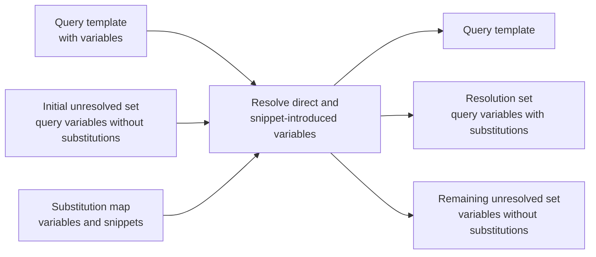
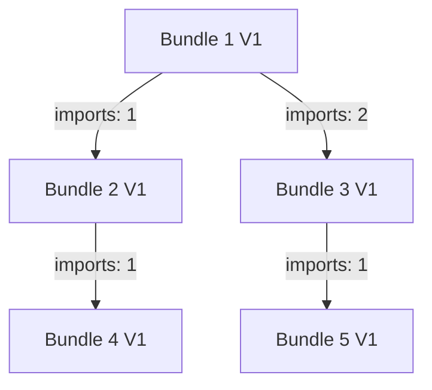

# Concept of Operations: Variable Inheritance Using Bundles in the Query Tool

## Introduction

This document explains the inheritance tree and proper operation of the Query Tool used to edit and maintain SQL templates, bundles, and variable-snippet pairs.

## Terms

| Term | Definition | Other terms |
| --- | --- | --- |
| SQL template | A SQL query written using substitution variables to allow on-the-fly customization and configuration for different uses. | query, template, main query |
| Bundle | A named collection of substitution pairs. A substitution pair consists of a named variable and a SQL snippet that should be inserted in a SQL template wherever the variable is encountered. Bundles can be nested, creating an inheritance tree of substitution pairs. One bundle can import any number of other bundles except itself, and each imported bundle can inherit other bundles. Every set of imports is mandatorily sequenced, so the complete import and override order is always deterministic. The system prevents import or inheritance loops, both in the import graph and in recursive variable substitution. | |
| Variable | A typed placeholder represented by a specific node in the parsed SQL template AST. The grammatical location of that node determines its variable type. | |
| Snippet | A short, properly expressed SQL fragment parsed through the endpoint associated with its variable type. The resulting snippet AST subtree can replace a compatible variable node during query generation. | |
| Variable-snippet pair | A named variable of a particular type and its assigned SQL snippet. | substitution pair |
| predicand | A variable type recognized by the Query Tool. It represents any SQL snippet that could be used in a `SELECT` statement's column list. Anything that could appear in the select list and receive an alias is a predicand, including a column reference, formula, constant value, scalar subquery, or similar expression. | |
| tuple | A variable type recognized by the Query Tool. It represents a SQL snippet that could appear in a `FROM` or `JOIN` clause, including a table or object reference or a complete subquery containing its own `SELECT` statement. | |
| Substitution map | A set of variable-snippet pairs conceived as a key-value lookup. Each variable appears once with one snippet. The map is constructed from a bundle and its imported bundles by processing those bundles in a deterministic order and retaining the last snippet assigned to each variable name. | |
| Resolution sequence | The sequence in which bundles add their variable-snippet pairs to the substitution map. | |
| Resolution set | A query-specific subset of a substitution map containing only the variable-snippet pairs referenced directly or recursively by a particular query. Until every required variable is resolved, the query cannot be executed. | |
| Unresolved set | The variables required by the query that do not yet have usable substitutions. This includes unresolved variables in the original query and variables introduced by snippets selected during resolution. It represents the work the Query Tool user must complete before the query can run. | |

## Variable Inheritance and Resolution

### Basic Substitution

A simple query template might be:

```sql
select <Predicand> as col1,
       a.<Column> as col2
from <Source> as a;
```

The template contains three variables:

| Variable name | Variable type |
| --- | --- |
| `<Predicand>` | predicand |
| `<Column>` | column |
| `<Source>` | tuple |

The following substitution pairs might be defined:

| Variable name | Snippet |
| --- | --- |
| `<Predicand>` | `a.value * 100` |
| `<Column>` | `name` |
| `<Source>` | `schema.important_information` |

Applying the substitution pairs produces:

```sql
select a.value * 100 as col1,
       a.name as col2
from schema.important_information as a;
```

Collecting these three substitution pairs and saving them together creates a **bundle**. A bundle has a name, such as `default`, and a version name, such as `V1`. The query-specific set of variable-snippet pairs used to replace variables in a SQL template is the query's **resolution set**.

Panto uses a transaction called a **bound query** to run a combination of a template and a bundle. A second bundle containing different snippets could be applied to the same SQL template to make it perform different work.

### Design Intent: Preserve SQL as SQL

Panto's variable-substitution algorithm is designed to guarantee the **grammatical and syntactical compatibility** of a SQL template and every value substituted into it. A template variable is not an untyped opening into a text document, and a snippet is not arbitrary replacement text. Both are parsed SQL structures whose compatibility is established through the variable's grammatical type and AST location.

This provides a safer and more controlled composition mechanism than text-macro systems such as Jinja. A macro preprocessor can combine procedural template instructions with lexical rewriting to manufacture SQL text. That approach can produce valid SQL, but its intermediate operations occur outside the SQL grammar, so correctness is generally known only after the generated text is parsed.

Panto instead keeps composition inside the SQL grammar. It constructs the resulting statement from grammar-compatible AST subtrees and then generates SQL from that structure. Consequently, the result retains SQL's declarative, expression-oriented character rather than becoming a procedural text-rewriting program whose output happens to be SQL.

This guarantee is grammatical and syntactical. Whether referenced objects exist, data types are semantically compatible, or the resulting query expresses the intended business meaning may require subsequent catalog, type, or semantic validation.

### Typed AST Substitution

Panto substitution is not lexical string replacement. SQL templates, variable occurrences, and snippets are parsed into AST structures.

Each variable occurrence is assigned a type from its grammatical location in the SQL template. A snippet assigned to that variable is parsed using the corresponding fragment endpoint. During query generation, the generator traverses the SQL template AST depth-first. When it encounters a variable node, it retrieves the snippet AST subtree attached to that variable in the resolution set and generates that subtree in the variable node's location.

This design preserves grammatical correctness because a snippet is accepted and inserted only in an AST location compatible with its variable type.

Panto supports seven substitution-variable types:

| Variable type | AST or grammatical location | Representative template |
| --- | --- | --- |
| `tuple` | Table-like sources, including `table_source_primary`, `tuple_primary`, `FROM` and `JOIN` relations, DML target tables, unparenthesized `WITH ... AS <variable>` sources, and PIVOT/UNPIVOT sources. | `SELECT * FROM <[Enrollment Services].[Client Entering Class]> cec` |
| `column` | A `column_primary` or `column_reference`, either bare or qualified by a table/alias. | `SELECT studentTable.<StudentId> AS username FROM <StudentTable> studentTable` |
| `predicand` | Scalar or value-producing locations, including select-list expressions, arithmetic, formulas, constants, scalar subqueries, and scalar `GROUP BY` or `ORDER BY` expressions. | `SELECT <StudentIdentifier> AS nk, <Birthdate> AS birthdate FROM tab1` |
| `condition` | Boolean or filter locations, including complete `WHERE`, `HAVING`, `QUALIFY`, `JOIN ... ON`, `CASE WHEN`, and logical condition subtrees. | `SELECT * FROM tab1 WHERE <whereClause>` |
| `in_list` | An `in_predicate_value` or another supported list operand, such as the value following `IN`, `NOT IN`, or list-oriented `LIKE ANY`. | `SELECT * FROM scbcrse WHERE subj_code IN <inlist substitution>` |
| `query` | A whole-query location, including a parenthesized CTE body, an insert query source, or a set-operation branch. | `WITH getLastXTerms AS ( <GetLastXTerms> ) SELECT * FROM getLastXTerms` |
| `join_extension` | The trailing join-extension location following the main `FROM` list, allowing one or more additional joins to be generated. Its AST key is `extension`, while its substitution type is `join_extension`. | `SELECT * FROM third a JOIN fourth b ON <OnJoinCondition> <extension>` |

#### Context-sensitive distinctions

- `predicand` versus `condition` is determined from AST ancestry, not from the spelling of the variable. In `WHERE col = <x>`, `<x>` is normally a predicand. In `WHERE <filter>`, `<filter>` is a condition.
- A `WITH` variable is a tuple in `WITH staged AS <stg_src>`, but a query in `WITH terms AS ( <GetLastXTerms> )`.
- A Jinja/dbt-style table reference such as `{{ ref('monthly_sales') }}` is not a separate substitution type. In a table-source location it is represented as a tuple with a `jinja_table` subtree.
- Simple variables such as `<StudentId>` and extended multipart variables such as `<[HR Data].[Employee Accounts]>` use the type established by their AST context. A qualified column such as `studentTable.<StudentId>` retains its table reference while the variable node is typed as `column`.

### Importing Other Bundles

A bundle can import another bundle and inherit its substitution pairs. This lets a developer define standard SQL phrases once rather than copying them into every bundle. Copying the pairs everywhere would undermine the purpose of SQL templates.

In complex domains, many queries may share basic logic but require limited customization. A bundle can provide default values for many variables while leaving other variables for a particular use to configure.

### Imported Bundle Example

Consider a more complicated query template:

```sql
select <Full Name> as full_name,
       <Street Name> as street_name,
       <Age> as age
from <Source> as a;
```

This document refers to it as the **Basic Person V1** query template.

#### Basic Person V1 variables

| Variable name | Variable type |
| --- | --- |
| `<Full Name>` | predicand |
| `<Street Name>` | predicand |
| `<Age>` | predicand |
| `<Source>` | tuple |

Define a default bundle named **Person Default**, version **V1**:

#### Person Default V1 bundle

| Variable name | Snippet |
| --- | --- |
| `<Full Name>` | `(a.first_name \|\| ' ' \|\| a.last_name)` |
| `<Street Name>` | `substring(a.address_line_1, 5, 50)` |
| `<Age>` | `a.age` |

The bundle deliberately does not define `<Source>`. The source table may differ among uses of the query. Applying Person Default V1 therefore produces a partially resolved query:

```sql
select (a.first_name || ' ' || a.last_name) as full_name,
       substring(a.address_line_1, 5, 50) as street_name,
       a.age as age
from <Source> as a;
```

The query cannot execute until `<Source>` is resolved. That variable can be configured independently for each usage.

A second bundle can fill `<Source>` while importing Person Default V1 to inherit the standard predicand formulas. Define a bundle named **Alpha Example**, version **V1**:

#### Alpha Example V1 bundle

| Variable name | Snippet | Import sequence | Imported bundle |
| --- | --- | ---: | --- |
| | | 1 | Person Default V1 |
| `<Source>` | `customer.person_table` | | |

Applying Alpha Example V1 to Basic Person V1 produces a fully resolved query:

```sql
select (a.first_name || ' ' || a.last_name) as full_name,
       substring(a.address_line_1, 5, 50) as street_name,
       a.age as age
from customer.person_table as a;
```

## Resolution Process

Before substitution pairs are applied to a query template, the resolution process constructs a resolution set for the variables required by the query.

For Alpha Example V1, the process works as follows:

1. Open Alpha Example V1.
2. Discover that it imports Person Default V1.
3. Recursively inspect Person Default V1 for its own imports.
4. Add Person Default V1's pairs to the substitution map.
5. Return to Alpha Example V1.
6. Add Alpha Example V1's pairs, replacing any existing pairs with the same variable name.

After importing Person Default V1, the substitution map is:

| Variable name | Snippet |
| --- | --- |
| `<Full Name>` | `(a.first_name \|\| ' ' \|\| a.last_name)` |
| `<Street Name>` | `substring(a.address_line_1, 5, 50)` |
| `<Age>` | `a.age` |

After applying the remainder of Alpha Example V1, the substitution map is:

| Variable name | Snippet |
| --- | --- |
| `<Full Name>` | `(a.first_name \|\| ' ' \|\| a.last_name)` |
| `<Street Name>` | `substring(a.address_line_1, 5, 50)` |
| `<Age>` | `a.age` |
| `<Source>` | `customer.person_table` |

The resolver then searches the substitution map for every variable referenced by the query. It builds a query-specific subset called the **resolution set**. Each entry retains the typed snippet AST subtree associated with its variable. This search is recursive: a snippet selected for a query variable can itself contain variables, and those variables must also be looked up and added to the resolution set.

The search continues until every referenced variable has been found or the substitution map contains no matching pair. The resolution set is then available to the depth-first AST query generator.

Any variable that remains is included in the **unresolved set**. This can include variables from the original query and variables introduced by selected snippets. A query can execute only if its unresolved set is empty.

### Resolution model

The original PDF diagram is represented below as Mermaid so that Cursor can parse and explain it:



Conceptually:

```text
(query template + initial unresolved set) + substitution map
    -> query template + resolution set + remaining unresolved set
```

The final query text is generated from the query template AST and resolution set. The remaining unresolved set is checked first: if it is non-empty, query generation or execution must fail. If it is empty, the query generator walks the template AST depth-first. On reaching a variable node, it generates the compatible snippet AST subtree from the resolution set in that location. Variables encountered within a snippet subtree are handled recursively by the same depth-first process.

## Overriding an Imported Variable

Alpha Example assumes `customer.person_table` has the columns `first_name`, `last_name`, `address_line_1`, and `age`. A different source may not have that structure.

Define another bundle named **Beta Example**, version **V1**:

### Beta Example V1 bundle

| Variable name | Snippet | Import sequence | Imported bundle |
| --- | --- | ---: | --- |
| | | 1 | Person Default V1 |
| `<Source>` | `alumni.alumni_address` | | |
| `<Age>` | `(year(Now()) - year(a.birthdate))` | | |
| `<Full Name>` | `a.full_name` | | |

The resolver first constructs the map from Person Default V1. When it subsequently applies Beta Example V1, pairs with matching variable names replace inherited pairs. The resulting substitution map is:

| Variable name | Snippet | Origin/effect |
| --- | --- | --- |
| `<Full Name>` | `a.full_name` | Overrides Person Default V1 |
| `<Street Name>` | `substring(a.address_line_1, 5, 50)` | Inherited from Person Default V1 |
| `<Age>` | `(year(Now()) - year(a.birthdate))` | Overrides Person Default V1 |
| `<Source>` | `alumni.alumni_address` | Added by Beta Example V1 |

Applying this map to Basic Person V1 produces:

```sql
select a.full_name as full_name,
       substring(a.address_line_1, 5, 50) as street_name,
       (year(Now()) - year(a.birthdate)) as age
from alumni.alumni_address as a;
```

The operative precedence rule is:

> A variable-snippet pair applied later in the resolution sequence replaces an earlier pair with the same variable name.

## Resolution Sequence

A bundle can import multiple bundles, and each imported bundle can import others. Every bundle import is mandatorily sequenced. A bundle cannot have an unordered or indeterminate set of imports: the import metadata always establishes a total order for its directly imported bundles. That order, applied recursively, makes the complete import and override sequence deterministic even when the hierarchy is complex.

Imported bundles are processed in their required import sequence. All imports of a bundle are processed recursively before that bundle's own pairs are applied. Consequently, a descendant's pairs are applied before its importing ancestor's pairs, and the ancestor can override the descendant. Among sibling imports, a bundle processed later in the mandatory sequence can override values contributed by one processed earlier.

Consider this import graph:

| Bundle | Imported bundle | Import sequence | Nested imported bundle | Nested import sequence |
| --- | --- | ---: | --- | ---: |
| Bundle 1 V1 | | | | |
| | Bundle 2 V1 | 1 | | |
| | | | Bundle 4 V1 | 1 |
| | Bundle 3 V1 | 2 | | |
| | | | Bundle 5 V1 | 1 |



The substitution map for Bundle 1 is constructed in post-order depth-first sequence:

```text
Bundle 4 -> Bundle 2 -> Bundle 5 -> Bundle 3 -> Bundle 1
```

The resolver performs these operations:

1. Open Bundle 1 and locate Bundle 2 and Bundle 3, in that order.
2. Open Bundle 2 and locate Bundle 4.
3. Open Bundle 4 and find no imports.
4. Add Bundle 4's substitution pairs to the map.
5. Return to Bundle 2 and add or replace its pairs.
6. Return to Bundle 1 and continue to Bundle 3.
7. Open Bundle 3 and locate Bundle 5.
8. Open Bundle 5 and find no imports.
9. Add or replace Bundle 5's pairs.
10. Return to Bundle 3 and add or replace its pairs.
11. Return to Bundle 1 and find no more imports.
12. Add or replace Bundle 1's pairs.

If Bundle 1 reverses the import order of Bundle 2 and Bundle 3, the resulting resolution sequence becomes:

```text
Bundle 5 -> Bundle 3 -> Bundle 4 -> Bundle 2 -> Bundle 1
```

### Why ordered imports are useful

Bundles allow reuse of well-crafted or standardized SQL phrases, including formulas, complicated subqueries, and other common content. A default phrase may not suit every common use. An importing bundle can first inherit standardized snippets and then redefine a subset for a specialized purpose.

One real example is the GradesFirst queries used to populate the STC application. Different partner circumstances require slightly different subqueries, while each variation is still shared by a significant cohort of partners.

> **Design guidance:** Use nested imports sparingly. Plan the bundle hierarchy before creating a complex import tree. Place the most common and rarely overridden pairs toward the top of the import tree. Define complex substitutions and frequently overridden variables lower in the hierarchy. When the wrong snippet wins, inspect the resolution sequence first.

## Comparing Substitution Maps and Resolution Sets

A substitution map and a resolution set are closely related but not interchangeable:

- A **substitution map** contains all effective variable-snippet pairs produced by processing a bundle and its imports.
- A **resolution set** contains only the pairs needed directly or recursively by one query.
- An **unresolved set** contains the variables still required after all available substitutions have been considered.

A substitution map can contain variables irrelevant to a particular query. It can also lack one or more pairs required to resolve that query.

The conceptual operation is:

1. Parse the query and collect its variables into the initial unresolved set.
2. Match unresolved variables against the substitution map.
3. Move matching variables and snippets into the resolution set.
4. Parse selected snippets for additional variables.
5. Add snippet-introduced variables to the unresolved set and repeat matching.
6. Stop at a fixed point, when no additional variable can be resolved.
7. If the unresolved set is non-empty, do not generate or run the query.
8. Otherwise, recursively apply the resolution set to generate executable SQL.

### Example: a bundle with more pairs than a query needs

Using the Basic Person V1 template again:

```sql
select <Full Name> as full_name,
       <Street Name> as street_name,
       <Age> as age
from <Source> as a;
```

Define **Beta Example V2**:

| Variable name | Snippet | Import sequence | Imported bundle |
| --- | --- | ---: | --- |
| | | 1 | Person Default V1 |
| `<Source>` | `alumni.alumni_address` | | |
| `<Age>` | `(year(Now()) - year(a.birthdate))` | | |
| `<Full Name>` | `a.full_name` | | |
| `<Country>` | `'USA'` | | |
| `<Last Name>` | `split(a.full_name, ' ', 2)` | | |

Applying Beta Example V2 to Basic Person V1 produces the same fully resolved query as Beta Example V1:

```sql
select a.full_name as full_name,
       substring(a.address_line_1, 5, 50) as street_name,
       (year(Now()) - year(a.birthdate)) as age
from alumni.alumni_address as a;
```

The substitution map also contains `<Country>` and `<Last Name>`, but Basic Person V1 does not use them. Extra pairs are harmless. Keeping reusable snippets together can allow a suite of queries to mix and match standardized formulas.

Now consider an **Alternative Person V1** template:

```sql
select <Last Name> as last_name,
       <Street Name> as street_name,
       <Country> as country,
       <Age> as age
from <Source> as a;
```

Applying Beta Example V2 produces:

```sql
select split(a.full_name, ' ', 2) as last_name,
       substring(a.address_line_1, 5, 50) as street_name,
       'USA' as country,
       (year(Now()) - year(a.birthdate)) as age
from alumni.alumni_address as a;
```

From a maintenance standpoint, if three or four queries must share a complex formula, replacing copies of the formula with a common variable and maintaining one standard snippet is less error-prone. A formula change is made once in the bundle instead of being manually replicated across queries.

The same Beta Example V2 substitution map creates different resolution sets for the two templates:

| Variable name | Beta Example V2 substitution map | Basic Person V1 resolution set | Alternative Person V1 resolution set |
| --- | --- | --- | --- |
| `<Source>` | `alumni.alumni_address` | `alumni.alumni_address` | `alumni.alumni_address` |
| `<Age>` | `(year(Now()) - year(a.birthdate))` | `(year(Now()) - year(a.birthdate))` | `(year(Now()) - year(a.birthdate))` |
| `<Full Name>` | `a.full_name` | `a.full_name` | |
| `<Country>` | `'USA'` | | `'USA'` |
| `<Last Name>` | `split(a.full_name, ' ', 2)` | | `split(a.full_name, ' ', 2)` |
| `<Street Name>` | `substring(a.address_line_1, 5, 50)` | `substring(a.address_line_1, 5, 50)` | `substring(a.address_line_1, 5, 50)` |

## Implementation Semantics for Cursor

The following rules summarize the behavior described above in implementation-oriented form:

1. Require every bundle's direct imports to form a deterministic total order; unordered imports are not valid Panto bundle configuration.
2. Traverse imports recursively in mandatory import-sequence order.
3. Apply each imported bundle only after applying all of that bundle's imports.
4. Apply the root bundle after all of its imports.
5. Store substitution pairs in a map keyed by variable name.
6. On duplicate keys, the later pair replaces the earlier pair.
7. Reject direct and indirect bundle-import cycles.
8. Parse the SQL template into an AST and assign each variable occurrence a type based on its grammatical location.
9. Parse each snippet through the endpoint corresponding to its variable type and retain the resulting AST subtree.
10. Begin query resolution with variable nodes found in the SQL template AST.
11. Recursively inspect selected snippet AST subtrees for additional variables.
12. Store typed snippet AST subtrees, rather than raw replacement strings, in the resolution set.
13. Reject or defer execution whenever the fixed-point unresolved set is non-empty.
14. Reject recursive variable-substitution loops even if the bundle import graph itself is acyclic.
15. Generate SQL through a depth-first traversal of the template AST.
16. When generation encounters a variable node, generate its resolution-set snippet subtree in that location and continue depth-first through that subtree.
17. Preserve the surrounding AST context, such as a table qualifier on a column variable, when substituting the variable node.

Pseudocode:

```text
buildSubstitutionMap(bundle, activeImportPath):
    if bundle in activeImportPath:
        error "bundle import cycle"

    substitutionMap = emptyMap()
    activeImportPath.push(bundle)

    for importedBundle in bundle.imports ordered by importSequence:
        importedMap = buildSubstitutionMap(importedBundle, activeImportPath)
        substitutionMap.putAll(importedMap)  // later values win

    substitutionMap.putAll(bundle.variableSnippetPairs)
    activeImportPath.pop()
    return substitutionMap

buildResolutionSet(queryTemplateAst, substitutionMap):
    unresolved = variableNodesFrom(queryTemplateAst)
    resolutionSet = emptyMap()
    expanded = emptySet()

    while exists variable in unresolved not in expanded:
        variable = next unexpanded variable
        expanded.add(variable)

        if substitutionMap contains variable.name:
            pair = substitutionMap[variable.name]
            require pair.variableType == variable.type
            require pair.snippetAst was parsed through endpointFor(variable.type)
            resolutionSet[variable.name] = pair.snippetAst
            unresolved.remove(variable)
            unresolved.addAll(variableNodesFrom(pair.snippetAst))

    detectRecursiveSubstitutionCycles(resolutionSet)
    return (resolutionSet, unresolved)

generateQuery(queryTemplateAst, resolutionSet, unresolved):
    if unresolved is not empty:
        error "query is not fully resolved"

    return generateDepthFirst(queryTemplateAst, resolutionSet)

generateDepthFirst(astNode, resolutionSet):
    if astNode is a variable node:
        snippetAst = resolutionSet[astNode.variable.name]
        return generateDepthFirst(snippetAst, resolutionSet)

    output = emptyText()
    for child in astNode.children in grammatical order:
        output.append(generateDepthFirst(child, resolutionSet))
    return output
```

The pseudocode expresses the semantics, not necessarily the concrete internal API. In particular, the generator can stream generated SQL while traversing the snippet subtree; it does not need to mutate the original template AST into one large materialized tree.

### Parser endpoints

Panto exposes sixteen parser endpoints. Seven correspond directly to substitution-variable types; the remaining endpoints parse complete statements or other non-variable fragments.

| Endpoint | Grammar rule | Purpose | Representative fragment |
| --- | --- | --- | --- |
| `SQL` | `sql` | Full SQL statements, including queries, DML, and CTEs | `SELECT col FROM tab WHERE <filter>` |
| `SCRIPT` | `script` | Semicolon-separated multi-statement scripts | `CREATE TABLE t ...; SELECT * FROM t;` |
| `DDL` | `ddl` | DDL statements | `CREATE TABLE t AS SELECT ...` |
| `INSERT` | `insert_end_point` | Standalone `INSERT` statement | `INSERT INTO t (a) SELECT b FROM s` |
| `UPDATE` | `update_end_point` | Standalone `UPDATE` statement | `UPDATE t SET a = b FROM t2 WHERE c = 1` |
| `DELETE` | `delete_end_point` | Standalone `DELETE` statement | `DELETE FROM t USING (SELECT ...) s WHERE ...` |
| `TRUNCATE` | `truncate_end_point` | Standalone `TRUNCATE` statement | `TRUNCATE TABLE tab1` |
| `VALUES` | `values_statement_end` | Standalone `VALUES` matrix | `VALUES (1, 'aaa'), (92, 'aaa')` |
| `COLUMN` | `column_value` | A column-reference fragment used for `column` substitution | `table1.<emp_sales_count>` |
| `PREDICAND` | `predicand_value` | A scalar-expression fragment used for `predicand` substitution | `<emp_sales_count> + 1` |
| `CONDITION` | `condition_value` | A Boolean/filter fragment used for `condition` substitution | `<column condition>` |
| `IN_LIST` | `in_list_predicate_value` | A parenthesized list fragment used for `in_list` substitution | `(1, 2, 3)` |
| `TUPLE` | `tuple_value` | A table-source fragment used for `tuple` substitution | `<[domain].[entity]>` or `schema.table` |
| `QUERY` | `query_value` | A complete query-body fragment used for `query` substitution | `<simple variable>` |
| `JOIN_EXTENSION` | `join_extension_value` | Trailing join clauses used for `join_extension` substitution | `JOIN fourth b ON <OnJoinCondition>` |
| `LITERAL` | `literal_value` | A numeric or Boolean literal; this grammar endpoint does not accept variables | `42` or `true` |

## Conversion Notes

- The source PDF was exported from a wiki page and clipped several long SQL lines at the right page margin. The complete table names and `as a` aliases were restored from the templates and bundle tables immediately surrounding those lines.
- The source's Alternative Person example described its result as executable but displayed `<Source>` as unresolved and aliased `<Last Name>` as `full_name`. The Markdown uses the behavior implied by the template and substitution map: `alumni.alumni_address` and the alias `last_name`.
- The original visual diagram was replaced with a Mermaid flowchart and an equivalent text expression.
- Formatting and grammar were lightly normalized without changing the described resolution behavior.

## Information-Handling Notice

The storage or usage of personal information, including student data, is strictly prohibited within the source wiki application. This includes Tier 4 and Tier 5 data. Consult EAB Information Security when uncertain about the classification of information intended for storage.
